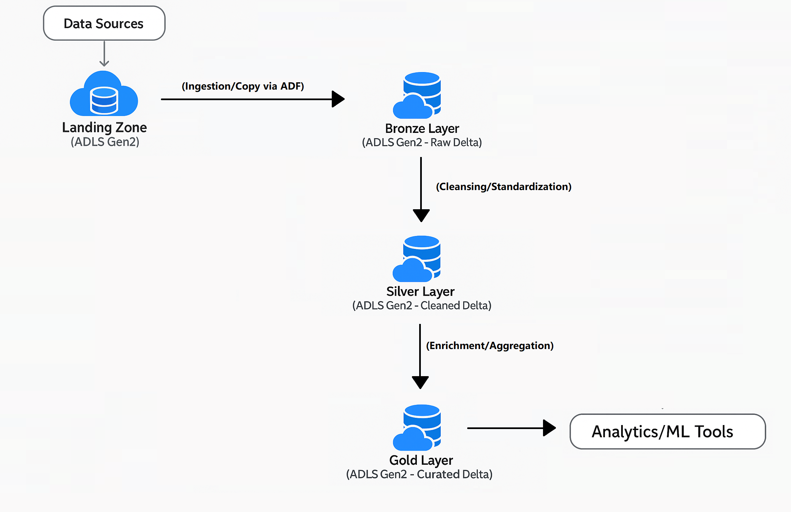
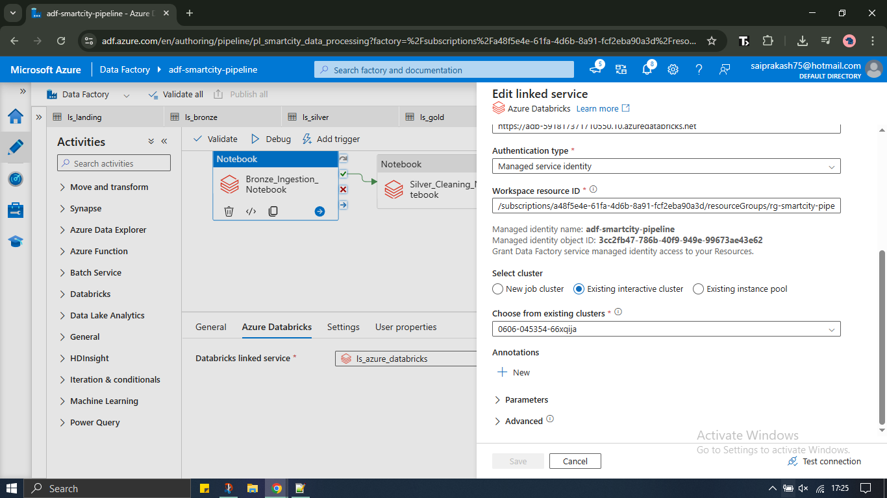

# Smart City Infrastructure Data Pipeline (Batch)

## Project Overview

This project implements a robust, end-to-end batch data pipeline on Microsoft Azure, designed to ingest, process, and analyze diverse **Smart City infrastructure-related data**. This includes crucial domains such as **traffic patterns, air quality, energy usage, waste collection, building permits, and public transport**.

**Problem Statement:** A modern smart city generates massive volumes of this infrastructure-related data daily. However, this data is often siloed, inconsistent, and messy, making it incredibly challenging to derive actionable insights.

**Solution & Significance:** Our pipeline addresses these challenges by leveraging a modern data lakehouse architecture. It transforms raw, inconsistent data into highly refined, curated, and easily consumable insights. This enables seamless downstream analytics, comprehensive reporting, and powers advanced AI/ML applications crucial for informed urban planning, efficient traffic management, precise environmental monitoring, and optimized resource allocation, ultimately contributing to a more sustainable and intelligent city.

## Architecture

The pipeline follows a Medallion Architecture (Landing, Bronze, Silver, Gold layers) within Azure Data Lake Storage Gen2, orchestrated by Azure Data Factory, with data processing powered by Azure Databricks.

## Technologies Used

* **Azure Data Factory (ADF):** For pipeline orchestration, scheduling, and monitoring.
* **Azure Databricks:** A unified analytics platform leveraging Apache Spark for powerful data transformation and processing.
* **PySpark:** Utilized within Databricks for developing robust and scalable data transformation logic.
* **Python:** The primary programming language used for scripting and data processing in Databricks.
* **Delta Lake:** The open-source storage layer used for building the data lakehouse, providing ACID properties, schema enforcement, and time travel.
* **Azure Data Lake Storage Gen2 (ADLS Gen2):** Scalable and secure data lake for storing all layers of data (Landing, Bronze, Silver, Gold).
* **Azure Key Vault:** (Implicitly used by Databricks for credential management if service principals are configured for external data sources).
* **Managed Service Identities (MSI):** For secure, credential-free authentication between Azure Data Factory and Azure Databricks, and between Databricks and ADLS Gen2.

## Data Flow & Pipeline Stages

The pipeline processes data through a structured medallion architecture:

1.  **Landing Zone:** Raw, unstructured or semi-structured Smart City sensor data is initially landed here.
    * **ADLS Gen2 Containers:**
      
        

2.  **Bronze Layer (Raw Data Ingestion):**
    * **Purpose:** Ingests raw data from the Landing Zone, converts it to Delta Lake format, and stores it in the `bronze` container. Data is kept in its raw form, providing a persistent, immutable record of source data with added ingestion metadata.
    * **Notebook:** `01_smart_city_bronze.py`

3.  **Silver Layer (Cleanse & Transform):**
    * **Purpose:** Cleanses, validates, de-duplicates, and performs basic transformations on the Bronze layer data. This layer ensures data quality and consistency. The processed data is stored as Delta tables in the `silver` container.
    * **Notebook:** `02_smart_city_silver.py`

4.  **Gold Layer (Curated & Enriched Data):**
    * **Purpose:** Enriches, aggregates, and prepares the Silver layer data into highly curated, business-ready datasets. These datasets are optimized for direct consumption by analytical tools, dashboards, and machine learning models. The Gold layer contains multiple Delta datasets, each tailored for specific analytical use cases.
    * **Notebook:** `03_smart_city_gold.py`
    * **Gold Layer Data Products:** Our Gold layer generates 7 distinct Delta Lake datasets, each addressing a specific Smart City domain:
        * `air_quality_enriched_delta`
        * `building_permits_enriched_delta`
        * `energy_enriched_delta`
        * `traffic_enriched_delta`
        * `transport_enriched_delta`
        * `waste_enriched_delta`
    
## Orchestrator 
Azure Data Factory is the primary orchestrator of this end-to-end data pipeline. It is configured to sequence the execution of Databricks notebooks, ensuring a controlled and automated flow of data through the medallion architecture layers.

### ADF Pipeline Canvas
The pipeline is designed with a clear, sequential flow.

### Successful ADF Pipeline Run
The monitoring view in ADF confirms the successful execution of the entire pipeline, demonstrating robust operation.

### Successful ADF Activity Run Details
Detailed output from a successful Databricks Notebook activity within the ADF pipeline, showing the notebook path and the job URL for direct traceability to Databricks logs.

## Azure Setup & Configuration

This section details the key Azure components and their configurations.

### Azure Resource Group
All Azure resources for this project are provisioned within a dedicated resource group for easy management and deletion.

### Azure Storage Account Overview
Overview of the ADLS Gen2 storage account used for the data lake.

### Databricks Workspace Overview
Overview of the Azure Databricks workspace used for Spark processing.

### ADF Databricks Linked Service Configuration
The Databricks Linked Service `ls_azure_databricks` connects Azure Data Factory to the Databricks Workspace.

### Databricks Cluster Details (with Cluster ID)
The pipeline utilizes an existing interactive Databricks cluster. This screenshot from the Databricks UI shows the cluster's configuration. 
The actual unique Cluster ID (0606-045354-66xqija) is obtained directly from the Databricks cluster details page, where it is also present in the URL. 
This ID is referenced by the ADF Linked Service.

### Authentication & Permissions
The pipeline leverages Azure's Managed Service Identities (MSI) for secure, credential-free authentication:
* **ADF Managed Identity:** The Data Factory's system-assigned managed identity (`adf-smartcity-pipeline`) is granted necessary permissions.
* **Permissions:**
    * **Databricks Workspace:** The ADF MSI needs Contributor role on the Databricks Workspace to submit jobs.
    * **ADLS Gen2:** The ADF MSI needs "Storage Blob Data Contributor" role on the ADLS Gen2 account to read and write data to the containers.

### Databricks Workspace Access Control (IAM)
Illustration of Managed Identity access to the Databricks Workspace.

### Storage Account Access Control (IAM)
Illustration of Managed Identity access to the ADLS Gen2 storage account.

## Gold Layer Data Verification

A dedicated Databricks notebook (`Verify_Gold_Layer.py`) is used to verify the integrity, schema, and content of the final Gold layer data products.

### All Gold Layer Datasets
This screenshot confirms the successful creation of all 7 Gold Delta Lake datasets in the `gold` container.

### Example: `traffic_enriched_delta` Schema Check
The schema of a sample Gold layer dataset (`traffic_enriched_delta`) is verified to ensure correct column names and data types after all transformations.

### Example: `traffic_enriched_delta` Sample Data
A preview of the data from the `traffic_enriched_delta` dataset, confirming the data content and transformation results.

---
